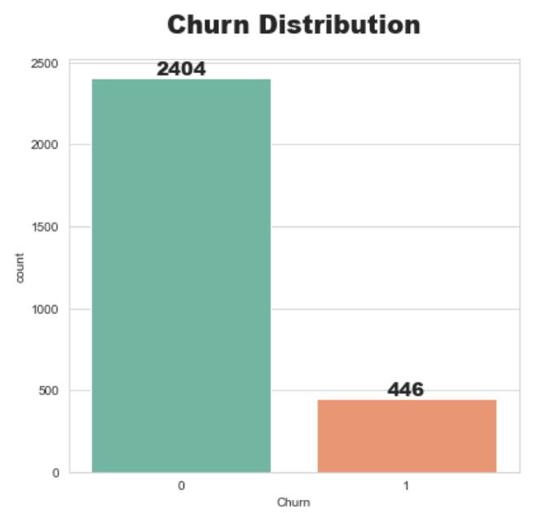
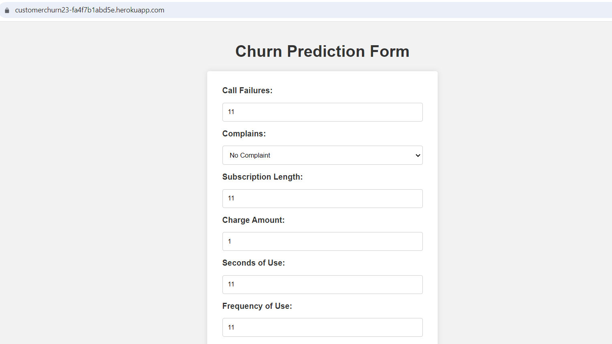
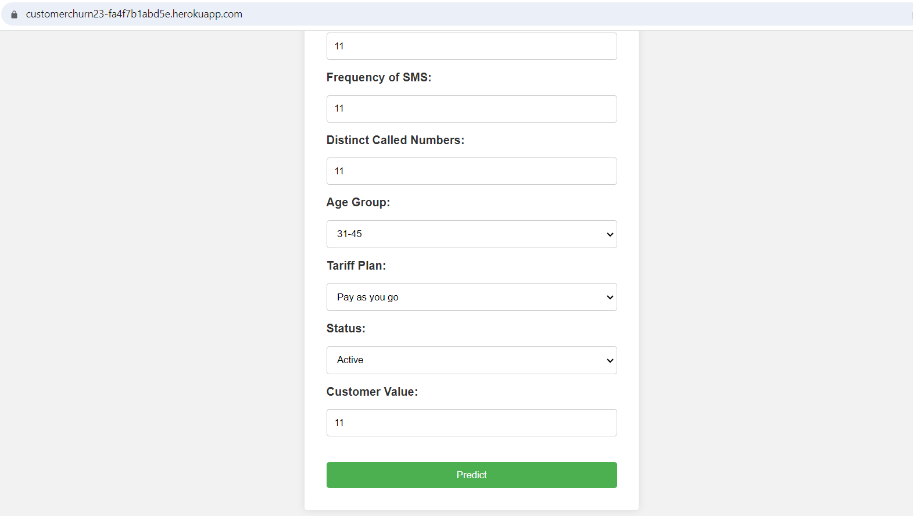
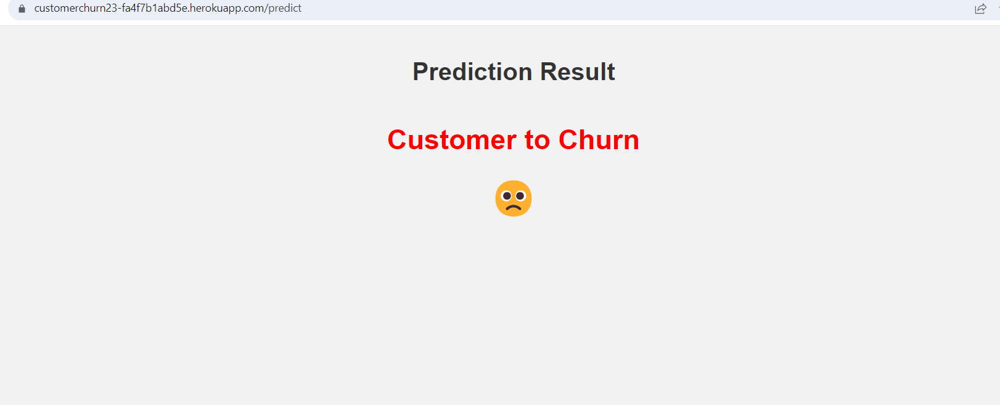

# Customer-Churn


This project aims to showcase an end-to-end implementation of a machine learning project, focusing on customer churn prediction. By leveraging various technologies and tools such as Dockers,Flask, GitHub Actions, and Heroku.

 Click [Here](https://customerchurn23-fa4f7b1abd5e.herokuapp.com/) to view the web application


## Table of Contents
- [Introduction](#introduction)
- [Skills Demonstrated](#skills-demonstrated)
- [Project Structure](#project-structure)
- [Software and Tools Requirement](#software-and-tools-requirement)
- [About Data](#about-data)
- [Data Cleaning](#data-cleaning)
- [Exploratory Data Analysis](#exploratory-data-analysis)
- [Model Selection, Training, and Evaluation](#model-selection-training-and-evaluation)
- [Pickle the Model](#pickle-the-model)
- [Flask Application and VS Code Setup](#flask-application-and-vs-code-setup)
- [Docker Integration](#docker-integration)
- [YAML Configuration](#yaml-configuration)
- [Deployment with Heroku](#deployment-with-heroku)
- [Results and Demo](#results-and-demo)


# Introduction
 In today's competitive business landscape, retaining customers is vital for sustained growth and profitability. By accurately predicting customer churn, companies can take proactive measures to retain valuable customers and optimize their strategies.

This project focuses on utilizing machine learning techniques to predict customer churn in a telecommunications company. By analyzing a comprehensive dataset of customer information and utilising powerful algorithms, a predictive model is developed that can identify customers who are likely to discontinue their services.

To showcase this complete end-to-end implementation, Dockers was integrated to create portable and scalable containers, GitHub Actions for automated build, test, and deployment processes, and deployed the application on Heroku for easy access and usage.

# Skills Demonstrated 
- Proficiency in machine learning techniques
- Data preprocessing and feature engineering
- Model selection, training, and evaluation
- Integration of Docker containers for portability and scalability
- Implementation of GitHub Actions for automated build, test, and deployment processes
- Deployment of the web application on Heroku
- Utilization of Flask for web application development
- Configuration and usage of YAML files for workflow automation
- Data analysis and interpretation for gaining insights
- Effective documentation and communication of the project
- Problem-solving and addressing real-world challenges through machine learning

# Project Structure
A brief description of each major file and folder, specifying their purpose and functionality within the project.

- **[Exploratory Analysis.ipynb](https://github.com/ObaroJoseph/Customer-Churn/blob/main/Exploratory%20Analysis.ipynb)** This Jupyter Notebook file contains the code and analysis for the exploratory data analysis (EDA) phase of the project. It explores the dataset, performs data visualization, and gains insights into the customer churn problem.
- **[Model Building.ipynb](https://github.com/ObaroJoseph/Customer-Churn/blob/main/Model%20Building.ipynb)** This Jupyter Notebook file contains the code for building and training the machine learning model.
- **[model.pkl](https://github.com/ObaroJoseph/Customer-Churn/blob/main/model.pkl)** This file is the serialized form of the trained machine learning model. It is saved as a pickle file and is used for making predictions on new data.
- **[app.py (Flask)](https://github.com/ObaroJoseph/Customer-Churn/blob/main/app.py)** This Python file contains the implementation of the web application using the Flask framework. It sets up the routes, handles user inputs, and utilizes the trained model to make churn predictions.
- **[index.html](https://github.com/ObaroJoseph/Customer-Churn/blob/main/templates/index.html)** This HTML file serves as the main entry point of the web application. It typically contains the user interface elements, such as forms or input fields, allowing users to provide the necessary information for churn prediction.
- **[result.html](https://github.com/ObaroJoseph/Customer-Churn/blob/main/templates/result.html)** This HTML file is responsible for displaying the churn prediction results to the user. Once the user submits the necessary information, the web application processes the inputs using the trained machine learning model.
- **[procfile](https://github.com/ObaroJoseph/Customer-Churn/blob/main/Procfile)** This file is used for Heroku deployment. It specifies the command to start the web application server, in this case, a Flask server, when the application is deployed on Heroku.
- **[Dockerfile](https://github.com/ObaroJoseph/Customer-Churn/blob/main/Dockerfile)** The Dockerfile is used to create a Docker image of the project. It specifies the base image, environment configurations, and instructions to set up the application within a Docker container.
- **[main.yaml](https://github.com/ObaroJoseph/Customer-Churn/blob/main/.github/workflows/main.yaml)** This is a configuration file for GitHub Actions. It defines the workflow for continuous integration and delivery, specifying the steps to build, test, and deploy the application automatically.
-**[requirements.txt](https://github.com/ObaroJoseph/Customer-Churn/blob/main/requirements.txt)** This text file lists all the dependencies and libraries required for running the project. It ensures that the required packages are installed in the environment to execute the code successfully.

# Software and Tools Requirement 
1. [Github Account](https//:github.com)
2. [Vs Code IDE](https://code.visualstudio.com/)
3. [Heroku](https://heroku.com)
4. [Git CLI](https://git-scm.com/book/en/v2/Getting-Started-The-Command-Line)
5. Jupyter Notebook

# About Data
This dataset is randomly collected from an Iranian telecom company database over a period of 12 months.

Link to obatin the dataset: https://archive.ics.uci.edu/dataset/563/iranian+churn+dataset

**Attribute Information**

- Call Failures: number of call failures
- Complains: binary (0: No complaint, 1: complaint)
- Subscription Length: total months of subscription
- Charge Amount: Ordinal attribute (0: lowest amount, 9: highest amount)
-Seconds of Use: total seconds of calls
- Frequency of use: total number of calls
- Frequency of SMS: total number of text messages
- Distinct Called Numbers: total number of distinct phone calls 
- Age Group: ordinal attribute (1: younger age, 5: older age)
- Status: binary (1: active, 2: non-active)
- Churn: binary (1: churn, 0: non-churn) - Class label
- Customer Value: The calculated value of customer
   


Utilizing a dataset consisting of 3150 records, a web application was created to demonstrate the successful application of a machine learning model in predicting the likelihood of a  customer  to churn. The development process involved the implementation of the following steps:


# Data Cleaning

By utilizing the pandas library, the dataset was efficiently read into a dataframe. Subsequently, duplicate entries and extraneous columns were effectively eliminated. Furthermore, a process of column renaming was executed to enhance clarity and coherence within the dataset.

```
data.rename(columns={'Call  Failure': 'call_failure',
                     'Complains': 'complains',
                     'Subscription  Length': 'subscription_length',
                     'Charge  Amount': 'charge_amount',
                     'Seconds of Use': 'seconds_of_use',
                     'Frequency of use': 'frequency_of_use',
                     'Frequency of SMS': 'frequency_of_sms',
                     'Distinct Called Numbers': 'distinct_called_numbers',
                     'Age Group': 'age_group',
                     'Tariff Plan': 'tariff_plan',
                     'Status': 'status',
                     'Customer Value': 'customer_value'}, inplace=True)
```

```
data = df.drop_duplicates()
```

# Exploratory Data Analysis

To perform Exploratory data analysis, **Matplotlib, plotly and Seaborn** were employed to generate insights. During the analysis, it was observed that the dataset exhibited a significant class imbalance. The majority class, labeled as "not Churn" (0), accounted for approximately 84% of the data points, while the minority class, labeled as "Churned" (1), comprised only around 20% of the datapoints. To overcome this class imbalance challenge, our machine learning algorithms incorporated the SMOTENN (Synthetic Minority Over-sampling Technique combined with Edited Nearest Neighbors) technique. 




# Model selection, training, and Evaluation

For this project, the Random Forest model was employed to address the task at hand. As previously mentioned, the SMOTENN technique was utilized to effectively handle the class imbalance present in the dataset. Through the implementation of this technique, an impressive accuracy of 97.2% was attained, demonstrating the model's robust performance in accurately predicting the target variable.

```

from sklearn.model_selection import train_test_split
from sklearn.ensemble import RandomForestClassifier
from imblearn.combine import SMOTEENN
sm = SMOTEENN()

X_resampled, y_resampled = sm.fit_resample(X, y)

X_train,X_test,y_train,y_test=train_test_split(X_resampled,y_resampled,test_size=0.20,random_state=56)

model=RandomForestClassifier(n_estimators=10).fit(X_train,y_train)

prediction=model.predict(X_test)

```

#  Pickle the Model:
After training the Random Forest model, it was serialized and stored as a pickled object. The pickled model was saved as a file named "model.pkl" to enable its usage in future applications or analyses. This approach ensures that the trained model can be easily retrieved and employed without the need for retraining, providing convenience and efficiency for future tasks.

```
import pickle
filename = 'model.pkl'
pickle.dump(model, open(filename, 'wb'))

```

# Flask Application and VS code Setup

- Navigate to the project directory from the command prompt:

```
cd <project_directory>
```

- Clone the repository from your github account to your local machine using the following command:


```
git clone <repository_url>

```

- Open the  VScode and select the folder comtaining the saved pkl file and  Create an environment and activate the environment

```
conda create -p venv python==3.7 -y
```
- Install the required dependencies by running the following command:

```
pip install -r requirements.txt

```
- Set User Name and Email:
```
git config --global user.name "Your Name"
git config --global user.email "your@email.com"

```

- Set up a Flask application
Create the necessary flask routes and templates to handle user input and display predictions.

Run the Flask application by executing the following command:
```
python app.py

```
# Create a Procfile
```
# Run the web server using gunicorn with the app:app configuration
web: gunicorn app:app

```

# Docker Integration:

Write a Dockerfile to package the Flask application and its dependencies into a Docker image.
Build the Docker image using the Dockerfile.

```dockerfile
# Use an appropriate base image
FROM python:3.7

# Set the working directory
WORKDIR /app

# Copy the project files into the container
COPY . /app

# Install dependencies
RUN pip install -r requirements.txt

# Copy the Procfile into the container
COPY Procfile /app/Procfile

# Set the entrypoint command
CMD gunicorn --workers=4 --bind 0.0.0.0:$PORT app:app 

```

# YAML Configuration:

Create a YAML configuration , main.yaml for GitHub Actions.
Define the workflow steps in the YAML file to automate the build, test, and deployment processes.

# Deployment with Heroku:

Create a Heroku account and set up a new Heroku application.
Connect your GitHub repository to Heroku for seamless deployment.
Configure the necessary environment variables in the Heroku app settings.
Deploy the Dockerized Flask application to Heroku.

 Click [Here](https://customerchurn23-fa4f7b1abd5e.herokuapp.com/) to view the web application


# Results and Demo:









